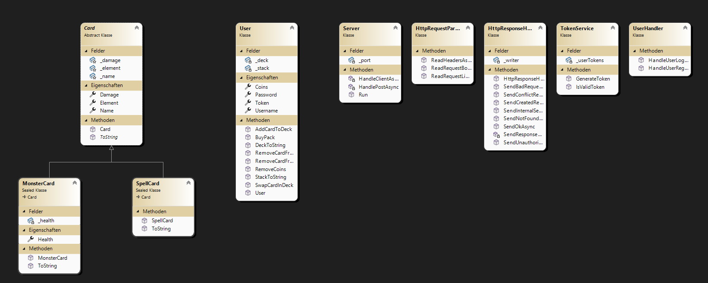

# MonsterTradingCardsGame

## Github
https://github.com/pedaKrk/MonsterTradingCardsGame

## Setup
In appsettings.json DatabaseSettings setzen.
Das create script befindet sich im DAL/Migrations Ordner.

Es sollte alles funktionieren bis auf Battles.
Curl Test Script ist im Root vom Projekt MonsterTradingCardsGame.

## Unique Feature
Das Unique Feature, ist das überarbeitete Trading System.
Durch das Hinzufügen von Preisen zu den jeweiligen Deals, entsteht eine eigene Economy
innerhalb des MonsterTradingCardsGame.

## Struktur
Das Projekt trennt durch NameSpaces die verschiedenen Layer. 
Models beinhaltet alle Modelle, 
Http alle Http lastigen sachen (unteranderem den Server),
Dal beschäftigt sich mit den Repositories und der Datenbankverbindung,
BusinessLogic mit all der Logik zwischen den bereichen.

## Klassendiagramm

## UnitTests
Die UnitTests prüfen Hauptsächlich die BusinessLogic.
Dadurch wird sichergestell, dass zum Beispiel nur Gewisse User manche Aktionen aus dürfen,
oder dass Packages nur mit genügend Coins gekauft werden können.